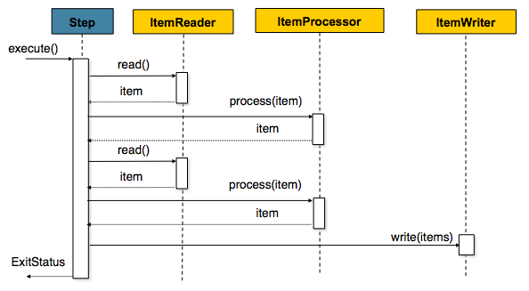

## 2021/3/16
### Radix NewCluster() 동작 파악
1. cluster를 생성할때 host 정보와 함께 실행할 cluster operation을 받는다.
2. 기본적으로 실행되어야 하는 default operation을 실행하고, 인자로 받은 operation을 실행한다.
3. default operation : default pool 생성 함수 지정, cluster sync 주기 설정, cluster down state 기준 설정

## 2021/3/17
### Radix connection 관리
처음 cluster와의 connection을 생성할 때나, client를 이용해 작업을 수행할때 non-application level의 에러(timeout, disconnect, ...)가 발생하는 경우 자동으로 conn을 close한다.
-> lastIOErr에 최근 발생한 IO 에러를 저장하고, pool에 conn을 put할때 lastIOErr를 확인하여 not nil이면 close() 호출

## 2021/3/18
### leetcode 문제 풀이
Reverse Integer
32bit integer를 입력받고 뒤집어진(321 -> 123) 32bit integer를 출력하는 문제.
나누기 연산과 나머지 연산을 이용하여 나머지로 나눈 숫자를 결과에 더하고 자릿수를 늘려주는 방식으로 문제를 해결했다.
제한사항으로 뒤집어진 숫자가 32bit integer 범위를 넘어가면 0을 return해야한다는 부분이 있었는데, 
min, max값에서 나누기 10을 한 값과 더하려고하는 나머지 숫자를 확인해 min, max를 체크하여 처리.
처음엔 list에 넣어서 값을 처리했는데, 메모리 절약을 위해 리스트 안쓰는 형태로 다시 풀었다.

## 2021/3/19
### leetcode 문제풀이
Palindrome number
숫자가 회문인지 확인하는 함수를 짜는 문제. string 전환 후 reverse하여 기존 숫자와 같은지 확인하는 방식의 답이 많았는데, 문제 조건에서 integer 그대로 변환하지 않은 상태에서 풀어보는 제약조건이 있었기에 그렇게 풀어보았다.
reverse integer와 거의 같은 방법으로 풀었다. 나누기 + 나머지 연산 하여 숫자를 뒤집고 그 숫자가 원 숫자와 같은지 확인
썩 빠른 방법은 아니었기때문에, 다른 방법이 있는지 찾아보아야함.

## 2021/3/20
### leetcode Longest common prefix(easy)
주어진 string slice에 대하여 가장 긴 prefix를 출력하는 문제.
horizontal scanning과 같은 방식으로 index 0부터 모든 string[i]를 비교하여 완전 일치할때마다 저장하는 방식으로 처리하였다.(가장 간단한 방식으로 풀었음.)
해답에서는 Divide & conquer나 binary search등의 방식으로 풀이했는데, 실제로 complexity가 얼마나 차이나는지 비교해 보아야함.
golang이 기본적으로 성능이 빨라서 상대적으로 얼마나 느린지가 잘 측정이 안되는 상황.

## 2021/3/21
### leetcode Roman to integer(easy)
주어진 Roman 숫자를 integer로 변환하는 문제.
기본적으로 I -> 1, X -> 10, V -> 5 처럼 문자와 숫자가 1:1 매핑되어있어 변환하여 전부 더해주면 된다.
그러나 어떤 문자 왼편에 숫자와 조합하는 경우 숫자의 의미가 조금 다르게 해석될 여지가 있어 그부분을 처리해주어야한다.
예를들면 4를 표시할때 IIII가 아니라 IV라는 방식으로 표현하기때문에, 이를 처리해주어야한다.
hint에서 알려주듯이 로만 문자 오른쪽에서부터 순차적으로 문자를 하나씩 변환하여 더해주면 문제 풀기가 수월하다.
처음에는 예외처리할 문자를 일일이 확인하여 뺄셈을 해주었는데, 보통 왼쪽으로 갈수록 숫자가 커지는데 왼쪽 숫자가 오른쪽 숫자보다 작은 경우가(IV -> 1 < 5 -> 4) 
예외처리 해주어야하는 특이케이스인 것을 이용하여 왼쪽 숫자가 오른쪽 숫자보다 작은경우 뺄셈을, 아닌경우 덧셈을 사용해주면 좀더 간단하게 문제풀이가 가능하다.
문자 맨 끝은 오른쪽 문자를 볼필요 없으니 처음에 초기값으로 구해주면 편하고, 모든 경우에 전부 옆 문자를 확인하기보다 특정 문자(I,X,C)가 들어왔을때만 확인하도록 하는 것이 속도를 조금 더 단축시킬 수 있다.

## 2021/3/22
### leetcode Valid parentheses(easy)
괄호를 validation 하는 문제.
소, 중, 대괄호가 적절하게 열고 닫혔는지 검증하여야한다.
각각의 open 괄호가 등장했을때 stack에 push하고, close 괄호가 등장할때 pop해서 pop된 char가 적절한 char인지 검증하면 된다.
stack을 pop할때 길이에 주의해야한다.

## 2021/3/23
### [leetcode](https://leetcode.com/problems/remove-duplicates-from-sorted-array/) remove duplicates from sorted array (easy)
sorted array의 중복을 O(1)의 메모리 추가로(추가 리스트 사용 불가) 제거하는 문제.
처음 접근은 golang의 slice 연산을 이용하여 중복이 발생하는 index만큼 건너뛰어 slice를 매번 잘라서 다시 선언해주었다.
풀이에는 성공하였으나 성능이 매우 느려 문제를 다시보니 list의 element를 직접 삭제할 필요가 없이 return으로 넘겨주는 length만큼만 검증한다는 조건이 있었다.
즉, 실제로 중복 숫자를 제거할 필요가 없는것이다.
solution을 살펴보니 slow runner / fast runner를 이용하여 문제를 풀었다.
리스트 전체를 순회하는 fast runner j가 있고, unique list의 끝을 나타내는 slow runner i가 있다.
j를 증가시키며 i위치에 있는 값과 j위치에 있는 값을 비교하여, 서로 다르면(앞서고 있는 runner의 숫자가 unique하면) i를 한발짝 증가시키고 그 자리에 j의 값을 넣어준다.
```
i  j            ij              i  j           i     j          i  j
0, 1, 1, 2 -> 0, 1, 1, 2  -> 0, 1, 1, 2  -> 0, 1, 1, 2 -> 0, 1, 2, 2 
```
i는 unique 값이 나타날때만 증가하며 unique 값만 저장하게 된다. i를 기준으로 unique slice의 length를 return하면(i+1) 
전체 리스트중 unique한 부분만 읽게된다. (0,1,2),2
문제를 잘 읽을 필요가 있다.

## 2021/3/24
### Spring batch step의 구조
  
이 다이어그램은 스프링 배치의 핵심 개념을 도식화하였다. Job 하나는 1~n개의 step을 가지고 있으며, 각 step은 ItemReader, ItemProcessor, ItemWrite를 딱 한 개씩 가지고 있다. 각 Job은 JobLauncher가 실행하며, 현재 실행 중인 프로세스의 메타정보는 JobRepository에 저장된다.

스프링 배치 구현체의 대부분은 '덩어리(chunk) 지향'으로 개발되었다. 덩어리 지향 프로세싱이란 한 번에 데이터를 하나씩 읽어와서 트랜잭션 경계 내에서 쓰여질 '덩어리'를 만드는 것이다. `ItemReader`가 item 하나를 읽으면 데이터는 `ItemProcessor`에 넘겨지고 결국엔 합쳐진다. 읽어온 item 수가 commit interval과 같아지면 `ItemWriter`가 덩어리 전체를 write하고, 트랜잭션이 커밋된다. 다음은 이 절차를 도식화한 그림이다:
  

[reference: https://godekdls.github.io/Spring%20Batch/](https://godekdls.github.io/Spring%20Batch/)  

partitioning을 하게되면 이 chunk를 적절한 갯수로 split하고, 각각 분산하여 step을 실행한다. 나중에 이 결과를 join하여 합쳐준다.
작업단위(commit)가 step이고, 그래서 한 step을 구성하는 reader, writer가 각각 하나씩 있어야하는 듯 하다.
### markdown 몇가지
#### 표 그리기
```
|1|2|3|
|-|-|-|
|a|b|c|
|d|e|f|
```

|1|2|3|
|-|-|-|
|a|b|c|
|d|e|f|

#### 링크
```
[글씨](http://원하는_url.com)
```
[네이버](https://www.naver.com)

#### 이미지
링크 앞에 느낌표를 붙여주면 된다. 이미지 파일을 같이 commit하고 나서 경로를 써주거나, 파일 url을 괄호에 넣어주면 된다.
```


```

#### 개행이 되지 않을때
문장 마지막에 space 두번 입력해주면 잘 넘어간다.

## 2021/3/25
### [leetcode](https://leetcode.com/problems/merge-two-sorted-lists/) Merge two sorted lists (easy)
아래와 같은 자료구조를 갖고있는 linked list 두개를 정렬 상태를 유지하며 merge해야한다. merge sort가 떠오른다.
```go
// Definition for singly-linked list.
type ListNode struct {
    Val int
    Next *ListNode
}
```  
 처음 접근은 링크드리스트를 순회하며 작은 값의 next를 새 linked list 노드에 붙여나가는 방식이었다. 일단 무식하게 풀어보자.
```go
// first submission.
func mergeTwoLists(l1 *ListNode, l2 *ListNode) *ListNode {
    var dummy ListNode
    result := &dummy
    for l1 != nil && l2 != nil {
        if l1.Val > l2.Val {
            result.Next = l2
            result = result.Next
            l2 = l2.Next
        } else {
            result.Next = l1
            result = result.Next
            l1 = l1.Next
        } 
    }
    if l1 != nil {
        result.Next = l1
        result = result.Next
    }
    if l2 != nil {
        result.Next = l2
        result = result.Next
    }
    return dummy.Next
}
```
첫 시작 노드를 나타내기위한 dummy 변수를 하나 선언해주고, l1, l2 포인터가 nil이 될때까지 (list의 끝까지 갈때까지) 순회하며 next를 이어주면 된다.  
이렇게 풀어도 되지만 코드가 너무 길다. 더 짧게 풀수 있는 방법은 없을까?  
두 포인터의 Val을 비교하여 숫자가 작은 쪽의 포인터를 결과를 저장하기위한 linked-list node에 잇고 다음을 순회하는 작업이 반복되는데,   
이를 [tail call](https://en.wikipedia.org/wiki/Tail_call) 로 recursive 하게 풀 수 있다.
```go
// 2nd submission
func mergeTwoLists(l1 *ListNode, l2 *ListNode) *ListNode {
    if l1 == nil {
        return l2
    }
    if l2 == nil {
        return l1
    }
    if l1.Val < l2.Val {
        l1.Next = mergeTwoLists(l1.Next, l2)
        return l1
    } else {
        l2.Next = mergeTwoLists(l1, l2.Next)
        return l2
    }
}
```  
val을 비교하는 것을 recursion으로 후에 구하도록 하는 것이다.
각 리스트의 길이가 너무 길다면 stack overflow를 유발할 수도 있겠지만 list의 길이는 [0, 50] 범위이므로 이렇게 푸는 것이 더 깔끔하다.

## 2021/03/30
### React redux의 기본 구조
redux는 react의 상태관리 툴이다. vuex와 같이 flux 패턴을 가지고있는데, 대략적인 구조와 사용법을 정리해본다.  
아래는 vuex의 구조를 나타내는 다이어그램이다.
  
action을 정의하고 dispatch를 통하여 action을 실행하면 commit을 하게되ㅏ며 이후 mutate를 실행하여 실제 state까지 변화하는 구조를 갖고있다.  
redux는 아래와 같다.  

세부까지 묘사된 다이어그램은 아니라 조금 차이는 있지만, 비슷한 구조로 보인다.  
mutation이 reducer라는 이름으로 불리는 듯 하다. (당연히 flux 패턴을 적용했으므로 서로 같을수 밖에 없긴하다..)  
vuex와의 차이점은 connect()를 이용하여 redux의 state를 연결해주는 함수가 있다는 점 정도인 듯 하다. 

mapStateToProps(state, [ownProps]): (Function) store 의 state 를 컴포넌트의 props 에 매핑. ownProps 인수가 명시될 경우, 이를 통해 함수 내부에서 컴포넌트의 props 값에 접근 할 수 있다.

mapDispatchToProps(dispatch, [ownProps]): (Function or Object)  컴포넌트의 특정 함수형 props 를 실행 했을 때, 개발자가 지정한 action을 dispatch 하도록 설정. ownProps의 용도는 위 인수와 동일

connect()를 이용해 state를 props에 연동하면, 바로 사용이 가능하다.

Ref : https://velopert.com/1266